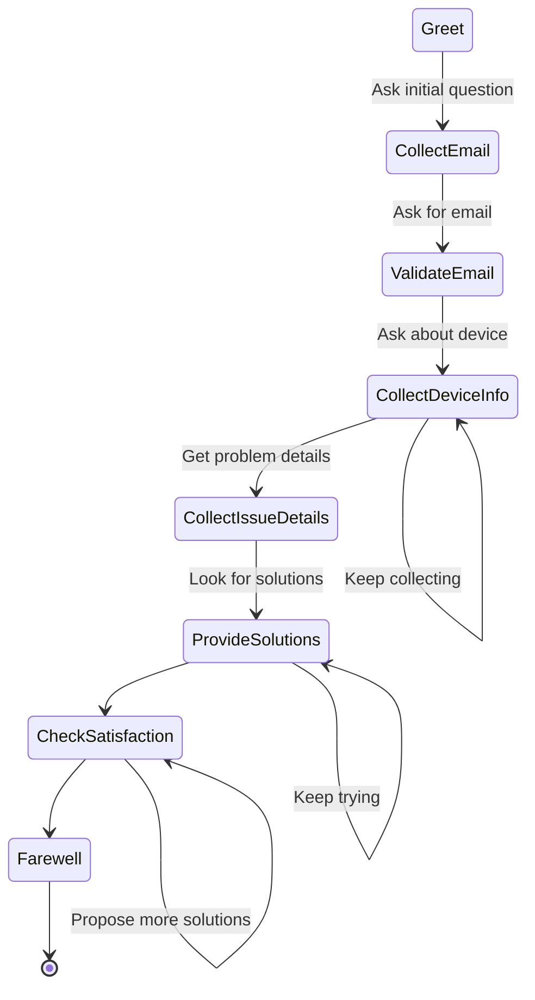

# Converser

A conversational agent following an automated customer support workflow.

## System Architecture



Converser is built around a state machine that guides the conversation flow, with specialized agents 
handling different stages of the customer support interaction. Each state in the diagram represents 
a conversation node where a specific agent collects or provides information.

The conversation follows these main steps:
1. **Greeting**: Initial contact with the customer
2. **Issue Collection**: Gathering preliminary information about the customer's technical problem
3. **Customer Identification**: Collecting and validating customer email
4. **Device Information**: Identifying the device type, brand, and model
5. **Problem Details**: Getting comprehensive information about the technical issue
6. **Solution Proposal**: Providing troubleshooting steps to the customer
7. **Satisfaction Check**: Determining if the problem was resolved or needs escalation
8. **Farewell**: Concluding the conversation appropriately

Each node in the graph contains an OpenAI Voice pipeline using the Agents SDK. The graph itself was made 
with Pydantic graph. Most frameworks for handling Agent orchestration are focused on having a graph of
agents to handle a single user request, our use case requires a graph to instead represent different
stages of the conversation, while each node could be either a single Agent or a "swarm".

A notable challenge is getting agents to both output structured (Pydantic/jsonschema) output while at
the same time streaming dialogue. Wating for the entire output object produces too much latency. This is
why we implement partial json parser: this allows the "dialogue" field to be streamed out first, then
the rest of the object is formed

## Features

- Voice-based conversational interface with text-to-speech
- Multi-agent architecture with specialized roles
- Customer sentiment tracking
- State persistence and conversation history
- Support for multiple languages
- Clear conversation flow with automated handoffs

## Setup Instructions

### Prerequisites

- Python 3.12 or higher
- Poetry (dependency management)
- Valid OpenAI API key

### Installation

1. Clone the repository
   ```
   git clone https://github.com/yourusername/converser.git
   cd converser
   ```

2. Install dependencies using Poetry
   ```
   poetry install
   ```

3. Create a `.env` file in the project root with your API key:
   ```
   OPENAI_API_KEY=your_api_key_here
   ```

### Running the Application

Start a conversation session:

```
poetry run conversation
```

Press space to start recording your message, and press space again to 
stop recording and send. Note that it's not push-to-talk.

To save conversation history:

```
poetry run conversation --directory data/conversations
```

To append conversation state to a TSV file:

```
poetry run conversation --tsv data/states.tsv
```

## Development

### Project Structure

```
.
├── data/                  # Saved conversations and state data
├── src/
│   └── converser/         # Main package
│       ├── agent.py       # Agent definitions and prompt templates
│       ├── audio.py       # Voice interface utilities
│       ├── graph.py       # Conversation flow graph definition
│       ├── main.py        # CLI entry point
│       └── parser.py      # Utilities for parsing agent responses
└── tests/                 # Unit tests
```

### Running Tests

```
poetry run pytest
```

## Further Improvements
- The sending of the audio can be much improved. A continuous stream should be implemented instead
of taking turns. OpenAIs realtime API could be used.

- Much refinement could be done on the agent prompts and the conversation graph.

- A current limitation is that all nodes must follow the pattern [User message]->[Agent response].
Some parts would be improved if the Agent were allowed to talk first.

- The user should be able to switch the conversation language. This is especially important at
the beginning.

- There should be more work done on improving general latency.

- Eventually should be made deployable and useable through websockets.

## License

MIT

## Credits

Built with [OpenAI Agents](https://github.com/openai/agents) and [Pydantic Graph](https://github.com/pydantic/pydantic-graph).
